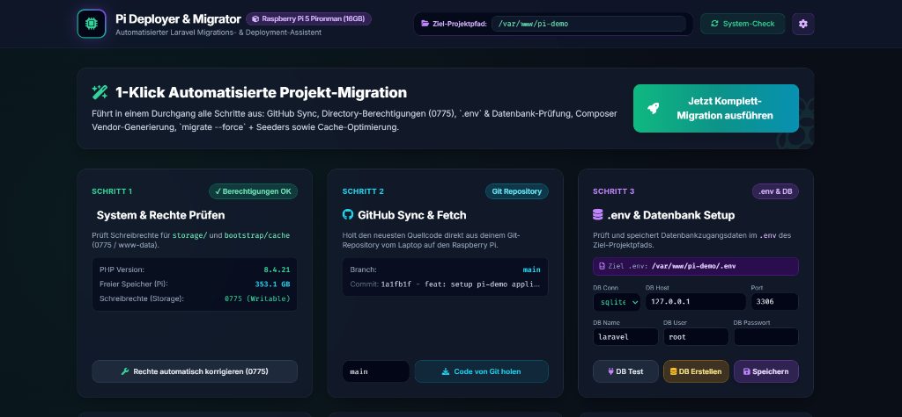
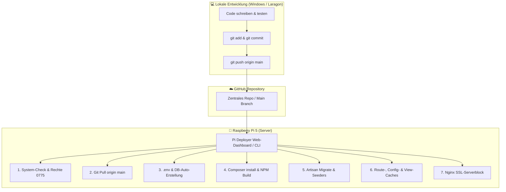

# 🍓 Raspberry Pi 5 | Laravel Migration & Deployment Assistent

[](https://laravel.com)
[](https://php.net)
[](https://raspberrypi.org)
[](LICENSE)

Ein hochmoderner, automatisierter Laravel Migrations- & Deployment-Assistent für den **Raspberry Pi 5 (Pironman 16GB Edition)** und lokale Entwicklungs- / Serverumgebungen.



---

## 🗺️ System-Architektur & Workflow

Der Deployment-Prozess folgt einem strukturierten 3-Stufen-Workflow für nahtlose Updates von deiner lokalen Entwicklungsumgebung bis auf den Raspberry Pi:



---

## 🌟 Kernfeatures & Sicherheits-Architektur

### 🛡️ Schutz- & Sicherheitsmechanismen
- **Sicherheitssperre gegen Self-Deployment**: Der `ResolvesTargetPath`-Trait verhindert zuverlässig, dass der Deployer versehentlich Aktionen auf sich selbst (`/var/www/pi-deployer`) ausführt.
- **Zielpfad- & Existenzvalidierung**: Vor jeder Aktion wird geprüft, ob der Zielpfad existiert. Fehlt der Ordner, bricht die Ausführung mit einer klaren Meldung ab.
- **Präziser Fehlerabfang im UI**: Tritt bei einem Schritt ein Fehler auf (z.B. fehlender `.git`-Ordner), stoppt die automatisierte Migration sofort und hebt die Fehlerursache rot im Log-Terminal hervor.

---

## 🧩 Modul- & Service-Übersicht

Der Assistent ist modular aufgebaut und teilt Aufgaben auf spezialisierte PHP-Services in `app/PiDeployer/Services/` auf:

| Service | Aufgaben & Funktion |
| :--- | :--- |
| **`SystemCheckerService`** | Überprüft Schreibrechte (`0775 / www-data`) für `storage/` und `bootstrap/cache`, prüft PHP-Erweiterungen und freien Speicherplatz. |
| **`GitService`** | Prüft Repository-Status, behebt Git `safe.directory`-Rechte automatisch und führt `git pull origin main` aus. |
| **`EnvironmentService`** | Liest & schreibt `.env`-Dateien des Zielprojekts, testet Datenbank-Verbindungen (`pi_test`) und erstellt MySQL/MariaDB-Datenbanken & -User. |
| **`ComposerService`** | Installiert ARM64-optimierte PHP-Vendor-Pakete (`composer install --no-dev`), prüft `package.json` und führt `npm run build` aus. |
| **`DatabaseMigrationService`** | Führt `php artisan migrate --force` (oder `migrate:fresh`) und Datenbank-Seeders für das Zielprojekt aus. |
| **`OptimizationService`** | Generiert `config:cache`, `route:cache` und `view:cache` für maximale Performance auf dem Raspberry Pi 5. |
| **`NginxService`** | Ermittelt freie Ports (z.B. `8445`), generiert maßgeschneiderte Nginx Server-Blocks inklusive SSL und liefert fertige Setup-Befehle. |

---

## 💻 Schritt-für-Schritt Einrichtung auf dem Raspberry Pi

### 1. Repository klonen & Abhängigkeiten installieren
```bash
cd /var/www
git clone https://github.com/dein-user/pi-deployer.git
cd pi-deployer

# Entwicklungs-Pakete von Pi-Deployer installieren:
composer install

# Berechtigungen setzen:
sudo chown -R www-data:www-data /var/www/pi-deployer
sudo chmod -R 775 storage bootstrap/cache
```

### 2. `.env` im Deployer anpassen
Erstelle oder öffne `/var/www/pi-deployer/.env` und trage den Pfad deines Ziel-Laravel-Projekts ein:
```env
# Absoluter Pfad zum Ziel-Laravel-Projekt auf dem Pi:
PI_TARGET_PROJECT_PATH=/var/www/mein-ziel-projekt

# Sicherheitssperre (Standard: false):
PI_ALLOW_SELF_DEPLOY=false
```

---

## ⚙️ Nginx Konfiguration für den Raspberry Pi

Eine vorgefertigte Nginx-Konfigurationsvorlage liegt in [`nginx.conf.example`](file:///c:/laragon/www/pi-deployer/nginx.conf.example).

```bash
# 1. Vorlage nach /etc/nginx/sites-available kopieren:
sudo cp /var/www/pi-deployer/nginx.conf.example /etc/nginx/sites-available/pi-deployer

# 2. Symlink aktivieren:
sudo ln -s /etc/nginx/sites-available/pi-deployer /etc/nginx/sites-enabled/

# 3. Nginx testen und neu laden:
sudo nginx -t
sudo systemctl reload nginx
```

Das Portal ist anschliessend verschlüsselt erreichbar unter: `https://rhz.internet-box.ch:8445`

---

## 🖥️ CLI Befehle (Konsole)

Du kannst den Deployer sowohl über die Weboberfläche als auch direkt im Terminal bedienen:

### Rechte-Check & automatische Reparatur:
```bash
php artisan pi:check --fix
```

### Automatisches Deployment via Konsole:
```bash
php artisan pi:deploy --branch=main --seed
```

---

## 🛠️ Troubleshooting & Häufige Fragen (FAQ)

<details>
<summary><b>1. Git-Meldung: <code>fatal: detected dubious ownership in repository</code></b></summary>

**Ursache:** Das Verzeichnis gehört einem anderen Linux-User (z.B. `www-data`), weshalb Git aus Sicherheitsgründen abbricht.  
**Lösung:** Registriere das Verzeichnis in Git:
```bash
git config --global --add safe.directory /var/www/pi-deployer
git config --global --add safe.directory /var/www/mein-ziel-projekt
```
</details>

<details>
<summary><b>2. Seeder-Fehler: <code>Call to undefined function Database\Factories\fake()</code></b></summary>

**Ursache:** Composer wurde im Produktionsmodus (`--no-dev`) ausgeführt. Das Paket `fakerphp/faker` befindet sich in `require-dev`.  
**Lösung A:** Aktiviere im Pi-Deployer UI bei Schritt 4 den Haken bei *„Dev-Pakete (inkl. Faker) mitinstallieren“*.  
**Lösung B:** Installiere Faker im Zielprojekt in die Haupt-Abhängigkeiten:
```bash
cd /var/www/mein-ziel-projekt
composer require fakerphp/faker
```
*(Composer fragt: "Do you want to move this requirement?", antworte mit `yes`)*.
</details>

<details>
<summary><b>3. Fehler: <code>The route pi-deploy/api/create-db could not be found</code></b></summary>

**Ursache:** Auf dem Pi ist noch ein veralteter Laravel Route-Cache aktiv.  
**Lösung:** Leere den Route-Cache von Pi-Deployer:
```bash
cd /var/www/pi-deployer
php artisan route:clear
```
</details>

<details>
<summary><b>4. Was tun, wenn der Ziel-Ordner noch leer ist?</b></summary>

**Lösung:** Klone dein Ziel-Repository zuerst in den Ordner:
```bash
git clone https://github.com/dein-user/dein-projekt.git /var/www/mein-ziel-projekt
sudo chown -R www-data:www-data /var/www/mein-ziel-projekt
```
</details>

---

## 👨‍💻 Entwickler & Credits

- **Developer & System Architect**: **Robert Hofer** (Zürich, Schweiz) — `robert.hofer.zuerich@bluewin.ch`
- **AI Pair Programmer**: **Antigravity AI** (Google DeepMind Team) — *Advanced Agentic Coding*
